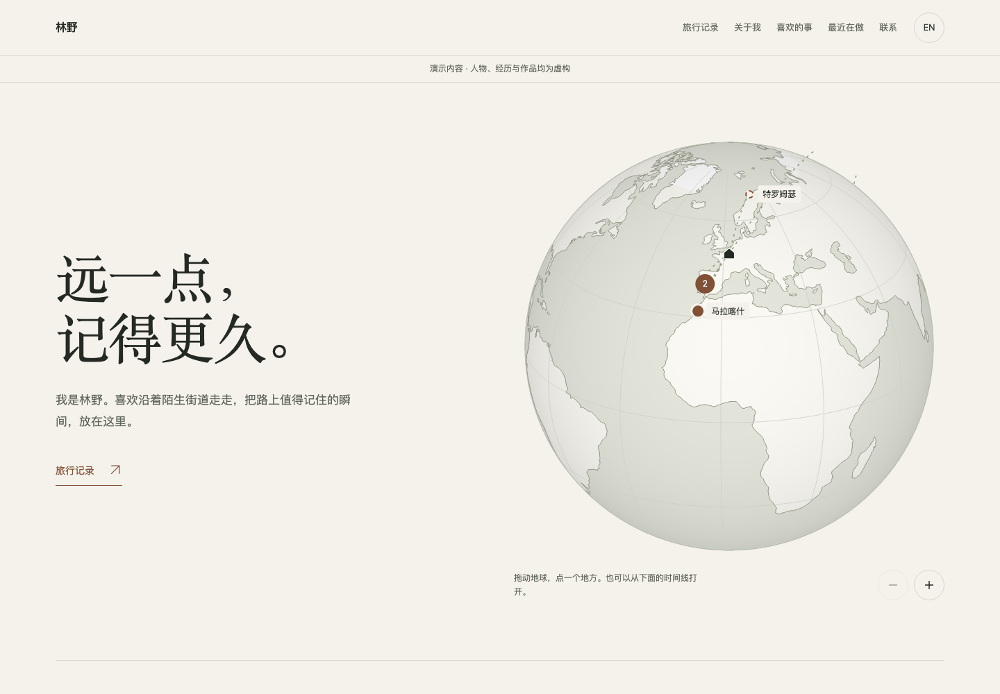
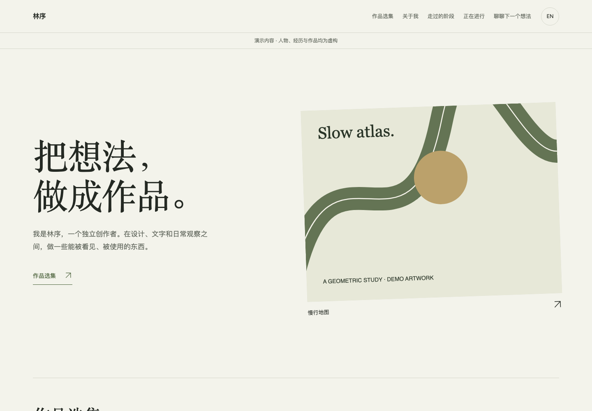

# your-portfolio

**简体中文** | [English](README.en.md)

**旅行者与创作者，两套可以持续更新的个人主页模板。**

把走过的地方放进一颗可拖动的地球；把做过的东西整理成自己的作品集。填好资料清单，你可以自己改，也可以让 AI 帮你改。

HTML / CSS / JavaScript · 无构建步骤 · 无后端 · 无 npm 安装 · 无 CDN · 中英双语 · MIT

| 旅行者 Traveler | 创作者 Creator |
| --- | --- |
|  |  |
| 可拖动/缩放地球、地点聚合、旅行时间线、重复到访、照片与可选视频 | 作品陈列、项目详情、经历时间线、近况与联系入口 |

两套模板拥有独立页面与内容文件，共用通用功能。可开启、关闭、排序模块；创作者也能开启旅行记录，旅行者也能展示作品。没有强制运动主题、人物装饰或声音介绍。

所有演示人物、旅行故事、经历和项目均为虚构。图片是仓库内原创几何演示图，请替换成你自己的内容。

## 从这里开始

1. 点击仓库的 **Use this template → Create a new repository**，或下载 ZIP。
2. 在 [资料清单](docs/worksheet.md) 里填你愿意公开的内容。
3. 把仓库文件和 [基于模板建站提示词](prompts/use-template.md) 给能读取项目文件的 AI；或者自己修改下面的 YAML。
4. 本地预览，检查结果，按 [发布指南](docs/deploy.md) 上线。

> 能提供建议的聊天 AI，不一定能直接读取仓库、修改电脑文件或替你发布。提示词会先让 AI 说明当前能力，再采用合适的方式。完整提示词与文件需要一起使用。

## 本地预览

在项目目录运行（需要 Python 3）：

```bash
python3 -m http.server 8090 --bind 127.0.0.1 --directory public
```

打开 <http://127.0.0.1:8090> 选择模板；或直接打开 `/traveler/`、`/creator/`。**不要直接双击 HTML**：内容通过 HTTP 读取。

没有 Python？可以用编辑器的本地静态服务器。站点本身不需要 Node；Node 22+ 只供下方可选工具与测试使用。

## 只改你的内容文件

| 用途 | 路径 |
| --- | --- |
| 旅行者 | `public/traveler/content.yaml` |
| 创作者 | `public/creator/content.yaml` |
| 自己的图片/视频 | `public/assets/media/` |
| 共用界面翻译 | `public/content/ui.yaml` |

名字、首屏介绍、旅行、作品、经历、近况和联系入口都从 YAML 读取。`sections` 决定模块顺序，`enabled: false` 关闭模块；没有内容的模块自动隐藏。`site.languages: [zh]` 只用中文，`[en]` 只用英文，`[zh, en]` 提供双语。

[内容编辑指南](docs/content.md) 包含新增旅行、作品和模块的完整示例。换好所有示例后，把 `site.demo` 改为 `false`。

地图点选会播放约 1 秒的纸飞机飞行，再打开对应详情；时间线点击直接打开。将 `trips.flightAnimation` 设为 `false` 可关闭飞行。系统启用减少动态效果、直接访问详情或使用浏览器前进后退时，直接显示详情。飞机和起点图标沿用模板颜色，出发地来自 `trips.home`。

## 选一套，独立发布

```bash
node tools/check-content.mjs
node tools/export.mjs traveler
# 或 node tools/export.mjs creator
```

把 `dist/traveler/` 或 `dist/creator/` **作为站点根目录**发布。输出只含选中模板的数据、页面和共用资源，不包含另一套模板的数据、资料清单和开发文档。不要上传整个项目目录。输出目录已存在时工具会拒绝覆盖；先保留旧版本，再选择新的输出路径，例如 `node tools/export.mjs traveler dist/traveler-v2`。

不使用 Node 工具，也可以发布完整 `public/`，这会公开两套模板和模板选择页。[发布步骤](docs/deploy.md)

分享标题和简介需要写入静态 HTML，不能只靠页面加载后更新。改内容后运行 `node tools/sync-meta.mjs`；导出工具也会同步。填写 `site.url` 和 PNG/JPG 分享图后，导出的 HTML 会生成绝对分享链接。[媒体指南](docs/media.md)

## 给 AI 的三份提示词

- [基于模板建站](prompts/use-template.md)：保留已实现的功能，换成自己的资料。
- [自由设计，并按需参考模板](prompts/design-your-own.md)：自己决定需求与外观，明确参考哪些功能。
- [以后更新旅行或作品](prompts/update.md)：沿用现有结构更新，避免每次重建整个网站。

## 技术上包含什么

- Canvas 2D 正射投影地球、大圆路线、地点聚合、触摸旋转/捏合、键盘与缩放。
- 日期驱动的旅行集数、重复到访、国家/地点统计与未来旅行状态。
- 作品与旅行详情的深链接、刷新恢复、浏览器返回、Esc 关闭与焦点恢复。
- 单语/双语、滚动导航与阅读进度、模块开关和排序、减少动态效果设置。
- 数据校验、资源检查、静态分享信息同步、选定模板导出。
- 零 npm 依赖的模型/工具测试和通过 CDP 驱动 Chrome 的浏览器验收。

## 检查

```bash
node --test tests/*.test.mjs
node tools/check-content.mjs
node tools/check_trips.mjs
node tools/check-flight.mjs
```

最后一个命令需要本机 Chrome。macOS 默认路径已配置，其他系统指定 Chrome 可执行文件：

```bash
CHROME=/path/to/google-chrome node tools/check_trips.mjs
```

浏览器检查包括两套模板、中英文、320–1440px、地图交互、详情路由、模块关闭、缺图与文本转义；截图保存在被 Git 忽略的 `.local/screenshots/`。发布到你自己的托管后，仍需检查真实手机的视频播放和链接。

## 公开内容与素材

静态站的数据文件、照片和媒体可以被访客下载。页面不显示某字段，不等于字段保密。`robots.txt` 只是请求搜索引擎不要索引，**不是访问控制**。

默认示例不被索引；换成自己的公开内容后，可以按需要修改 `public/robots.txt`。邮箱可留空，生日和家庭信息不是必填项。原始素材放 `inputs/`，它不会进入 Git；只把决定公开的版本放进 `public/`。

## 许可

自有代码和几何演示图采用 [MIT](LICENSE)。js-yaml 与地图数据的来源和许可见 [第三方声明](THIRD_PARTY_NOTICES.md)。个人素材由使用者自行选择和管理。

预览图是本仓库虚构示例页面的实际浏览器截图，不是外部素材。
